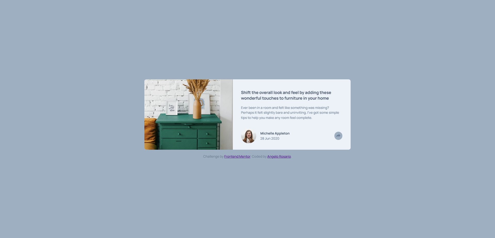
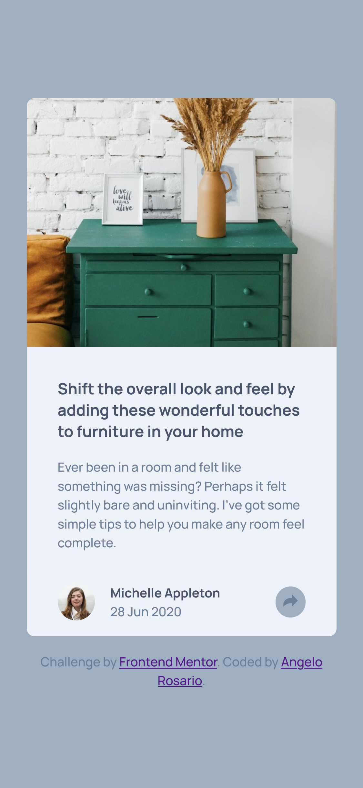

# Frontend Mentor - Article preview component solution

This is a solution to the [Article preview component challenge on Frontend Mentor](https://www.frontendmentor.io/challenges/article-preview-component-dYBN_pYFT). Frontend Mentor challenges help you improve your coding skills by building realistic projects. 

## Table of contents

- [Overview](#overview)
  - [The challenge](#the-challenge)
  - [Screenshot](#screenshot)
  - [Links](#links)
- [My process](#my-process)
  - [Built with](#built-with)
  - [What I learned](#what-i-learned)
  - [Continued development](#continued-development)

## Overview

### The challenge

Users should be able to:

- View the optimal layout for the component depending on their device's screen size
- See the social media share links when they click the share icon

### Screenshot




### Links

- Solution URL: [GitHub](https://github.com/Sengsith/react-article-preview)
- Live Site URL: [Netlify](https://monumental-starlight-0690e1.netlify.app/)

## My process

My process started with creating the custom properties, writing the HTML, writing the react JS, and finishing up with general styling in that order.

### Built with

- Semantic HTML5 markup
- CSS custom properties
- Flexbox
- Mobile-first workflow
- [React](https://reactjs.org/) - JS library

### What I learned

I mainly used this project to practice organization and creating components using react. However, I did face a problem figuring out how to display the share information and icons when the desktop and mobile versions are fairly different. 

```js
  const handleOnClick = () => {
    if (document.querySelector('.Share').style.zIndex === "10") {
      document.querySelector('.Share').style.zIndex = 0;
      document.querySelector('.Author').style.zIndex = 10;
      document.querySelector('.Share').style.display = "none";
    }
    else {
      document.querySelector('.Share').style.zIndex = 10;
      document.querySelector('.Author').style.zIndex = 0;
      document.querySelector('.Share').style.display = "flex";
    }
  }
```
The code above is what I mainly used to display and hide the author and share components and put everything else related into the CSS.

### Continued development

It did take me a while to figure out a simple solution even if it's not the best. I would like to keep improving my problem solving skills and cleaning up my CSS.

## Author

- Frontend Mentor - [@Sengsith](https://www.frontendmentor.io/profile/Sengsith)